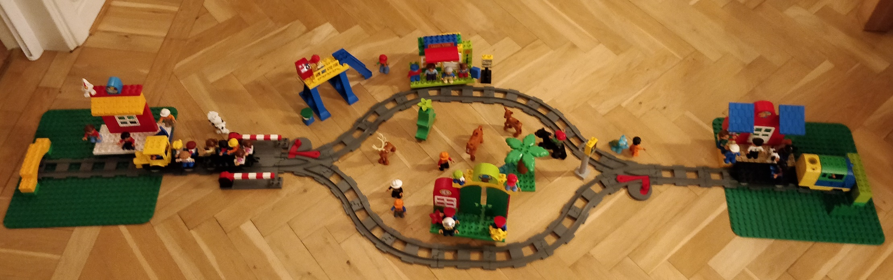
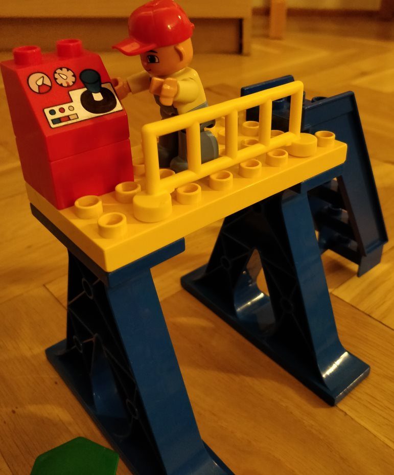
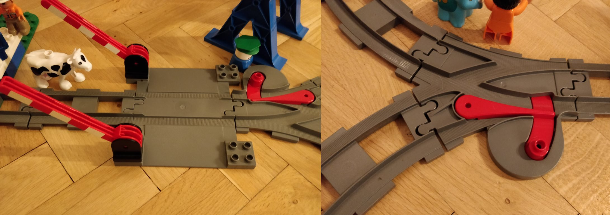
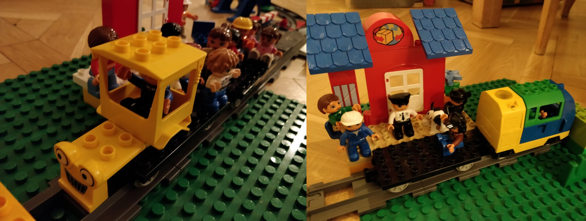

# Project 2 - The train track

For the procedures used in this project see : [Procedures](Procedures.md)

For the documentation by the team see: [Documentation/readme.md](Documentation/readme.md)

# Tre train track

The goal of this project is to create a small train simulator.

The track consist if four stations, two end stations and two in-between, on separate tracks. 

The trains on the track is controlled by the control tower where the operator (mr Carlos Lyons), makes sure the trains follows the time schedule by starting and stopping the trains at the stations, he also controls the level crossing and the railroad switches.





The track have currently two active trains going back and forward Golden Arrow and Lapplandståget



Each train have a wagon with passengers, these gets on and of at different stations.

## Your assignment

Write a program to control the simulate the trains on the track. Before starting make sure to plan your work by doing CRC cards, besides that can you also do mind map or diagrams.

Produce a fluent API used by mr Carlos Lyons to plan the trains, it could maybe look something like this:

```C#
var travelPlan1 = new TrainPlaner(train1).FollowSchedule(scheduleTrain1).LevelCrossing().CloseAt("10:23").OpenAt("10:25").SetSwitch(switch1, SwitchDirection.Left).SetSwitch(switch2, SwitchDirection.Right);

var travelPlan2 = new TrainPlaner(train2).StartTrainAt("10:23").StopTrainAt("10:53");
```

The trains should be running in a thread, so the can run synchronically, and be control a bit like this:

```c#
train.Start();
train.Stop();
```

Create your own mini ORM for the data provided, you also need to design a data notation for the track, so it can be loaded dynamically. 

And remember to create unit tests, where possible.

## Given

Some files are given in this repository.

**Data**

This folder contains five files:

* Passengers: A list of possible passengers, missing information on where the passengers are going
  * columns separated by ';'
* Stations: All trains stations on the track, 
  * columns separated by '|'
* Timetable: contains information on when each train is leaving and arriving the stations, should be extended with more departures per train
  * columns separated by ','
* Trains: contains a list of trains, some trains are not active
  * columns separated by ','

- Traintrack: An empty file, **you** should develop the content so that it describes the track, it should contain information on, this information should be loaded into the application:
  - The stations placement
  - The placement of railway switches, level crossing and distances
- Controllerlog: An empty file which should be populated as time progress with information  relevant for the controller, like:
  - Which trains are arriving to the stations and when
  - When are the level crossing chancing state (open or closed)
  - When are the railway switches changing position, and to what

**Documentation**

The folder initially only contains one file called *readme.md*, this file is more or less empty.

In this folder should you place digital representations of all documentation you do. Screenshots, photos (of CRC cards, mindmaps, diagrams).

Please make a link and descriptive text in the *readme.md* using the markdown notation:

```markdown
# Our train project
What we have done can be explained by this mindmap.

Bla bla bla bla
```

**Source**

The source folder is more or less empty, it just contains one file a Visual Studio solution file, called *TheTrainTrack.sln*.

Please open this and add projects to it.